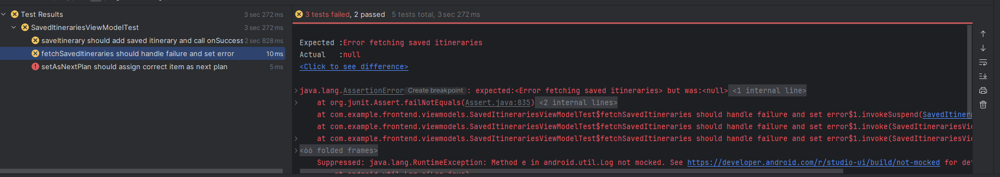

# Inclusive Trip Planner – Bug Tracking and Correction Plan

## 1. Introduction

This document outlines the strategy used to identify, categorize, and resolve software bugs throughout the development and testing lifecycle of the **Inclusive Trip Planner** application.

Although the project was developed by a single contributor, a structured approach was followed to manage bugs detected during unit testing, backend integration testing, and manual testing on the Android emulator.

The purpose of this plan is to ensure traceability of known issues, explain how they were resolved, and define a sustainable process for handling bugs in future iterations of the project. It aims to demonstrate that the application was built with a strong commitment to stability and maintainability.

## 2. Bug Classification

To manage bugs effectively, issues encountered during development and testing were categorized by severity. Each severity level indicates the potential impact on functionality, user experience, or stability.

### Severity Levels

| Severity     | Description                                                                 | Example                                                   |
|--------------|-----------------------------------------------------------------------------|-----------------------------------------------------------|
| **Critical** | Blocks core features or causes application crashes. Must be fixed urgently. | App crashes when submitting signup form with missing data |
| **Major**    | Significantly affects user experience or functionality but does not crash.  | Saved itineraries not displaying after app restart        |
| **Minor**    | Cosmetic or non-blocking issues that do not affect core workflows.          | Loading spinner remains visible too long after API call   |
| **Enhancement** | Not a bug, but a suggested improvement or UX adjustment.                 | Add visual feedback on successful itinerary save          |

### Classification Process

All issues discovered during development were immediately assessed based on their severity and impact.I assigned a category to each issue before deciding whether to fix it immediately or defer to a later milestone.

Whenever possible, test coverage was expanded to ensure the issue could not reoccur unnoticed.

_Figure 1 – A unit test failure uncovered during development.

## 3. Bug Reporting Process

Given the solo development context of the Inclusive Trip Planner project, bug reporting followed a lightweight but consistent approach. Bugs were discovered through a combination of automated test results, manual testing, and real-time code inspection during development.

### Reporting Channels

- **Automated Test Failures**:  
  Bugs were often surfaced during unit and integration test execution. Failures were inspected in the IDE (Android Studio or IntelliJ), and stack traces or assertion errors were reviewed to locate the cause.

- **Manual Testing Feedback**:  
  During emulator-based testing sessions, any unexpected UI behavior, crashes, or inconsistencies were noted in a local Markdown file or directly addressed in code comments.

- **Version Control Tracking**:  
  Fixes were documented using conventional Git commit messages with `fix:` or `bug:` prefixes, allowing for later filtering or traceability (e.g., `git log --grep fix:`).

### Informal Tracking Workflow

In the absence of a formal issue tracker, the following lightweight process was used to manage bugs:

1. **Detect** – Identify the issue through a test failure or manual observation.
2. **Describe** – Write a short summary or comment in the relevant code section.
3. **Classify** – Determine severity (Critical, Major, Minor, Enhancement).
4. **Resolve** – Implement a fix or create a TODO if deferring.
5. **Verify** – Re-run the relevant tests or manual scenario to confirm resolution.

This pragmatic method ensured that even without a dedicated tool, bugs were not ignored or forgotten during development.

## 4. Correction Workflow

Once a bug was identified and classified, a consistent correction workflow was followed to ensure the issue was resolved, tested, and verified without introducing regressions.

### Workflow Steps

| Step            | Description                                                                 |
|-----------------|-----------------------------------------------------------------------------|
| 1. **Reproduce** | Confirm the bug through test reruns or emulator interaction.                |
| 2. **Isolate**   | Trace the root cause in the relevant class, API call, or logic block.       |
| 3. **Fix**       | Apply a minimal change to resolve the issue. Update mocks or test data as needed. |
| 4. **Verify**    | Rerun the failing test case (or manual scenario) to ensure the bug is fixed. |
| 5. **Regressions** | Rerun related tests to confirm no existing behavior was broken.           |
| 6. **Commit**    | Use descriptive messages (`fix:` prefix) to log the fix in version control. |

### Commit Discipline

Each fix was committed with a message that clearly referenced the problem and, when applicable, linked it to the failing test or source line. This helped maintain a clean Git history and made it easier to trace how bugs were addressed.

This correction workflow was simple but effective in maintaining stability across a codebase that evolved rapidly during MVP development.

## 5. Lessons Learned

The development of the Inclusive Trip Planner MVP provided a valuable opportunity to apply structured testing and debugging practices within a solo project setting. This section reflects on key lessons gained through the bug tracking and correction process, and how they will inform future development cycles.

### 1. Test-Driven Debugging Accelerates Resolution

Running automated tests early and frequently helped detect regressions as soon as they occurred. Reproducing bugs using failing tests made it easier to pinpoint issues and verify fixes, saving time and reducing uncertainty.

> **Example**: A loading state inconsistency in the `ReviewViewModel` was discovered through a failed Turbine test and corrected before reaching production UI.

### 2. Commit Discipline Supports Traceability

Using `fix:` and `bug:` prefixes in Git commit messages created a clean, searchable history of issues and their solutions. This lightweight approach proved effective even without a formal issue tracker.

> **Reflection**: By consistently tagging commits, it became easy to trace not only what was changed, but *why* it was changed — especially useful during testing or presentation preparation.

### 3. Manual Testing Still Matters

Even with strong test coverage, manual emulator-based testing revealed issues not captured by automated flows — particularly UI delays, layout glitches, or edge cases caused by async behavior.

> **Lesson**: Visual and UX feedback, such as loading indicators and empty states, must be validated through real interaction, not just test assertions.

### 4. Bug Prevention Is a Mindset

Many bugs were avoided by proactively writing tests for expected failure paths, mocking edge cases, and thinking like a user. This reduced the volume of reactive bug fixing and kept the MVP stable under pressure.

> **Takeaway**: The most effective way to manage bugs is to build with testing in mind from the start — not just as a verification step at the end.

### 5. A Simple Process Is Better Than No Process

Although no bug tracking platform (e.g., Jira, GitHub Issues) was used, the informal workflow (detect → describe → classify → fix → verify) worked reliably. It enabled structured thinking without the overhead of formal tooling.

> **Conclusion**: What matters most is consistency. A lightweight, repeatable approach is sufficient to manage quality, especially in solo or early-stage projects.

---

These lessons form the foundation of a quality-first mindset that will carry into future phases of the project, including new features, CI integration, and collaborative development scenarios.

## 6. Bug Summary Table

The following table summarizes key bugs encountered during development and testing of the Inclusive Trip Planner MVP. Each entry documents the type, severity, resolution status, and a short description to demonstrate the nature of issues addressed throughout the project lifecycle.

| Bug ID | Type        | Severity   | Status    | Description                                                                 |
|--------|-------------|------------|-----------|-----------------------------------------------------------------------------|
| BUG-001 | Functional  | Critical   | Resolved  | App crashed when saving itineraries without a valid `itineraryId`.         |
| BUG-002 | UI/UX       | Minor      | Resolved  | Loading spinner remained active after a failed itinerary fetch.            |
| BUG-003 | API Logic   | Major      | Resolved  | Saved itineraries were not correctly fetched after user login.             |
| BUG-004 | State Sync  | Major      | Resolved  | `SignUpViewModel` did not reset fields after form submission.              |
| BUG-005 | Security    | Major      | Resolved  | Authenticated endpoints allowed access without validating JWT expiration.  |
| BUG-006 | Data Binding| Minor      | Resolved  | Settings UI did not reflect updated preferences after PUT request.         |
| BUG-007 | Enhancement | N/A        | Implemented | Added UI confirmation after saving an itinerary ("Saved!" message).        |

> _Note_: Bug IDs are for internal reference only. All bugs were resolved during the MVP phase prior to final submission and verified through corresponding unit or integration tests.